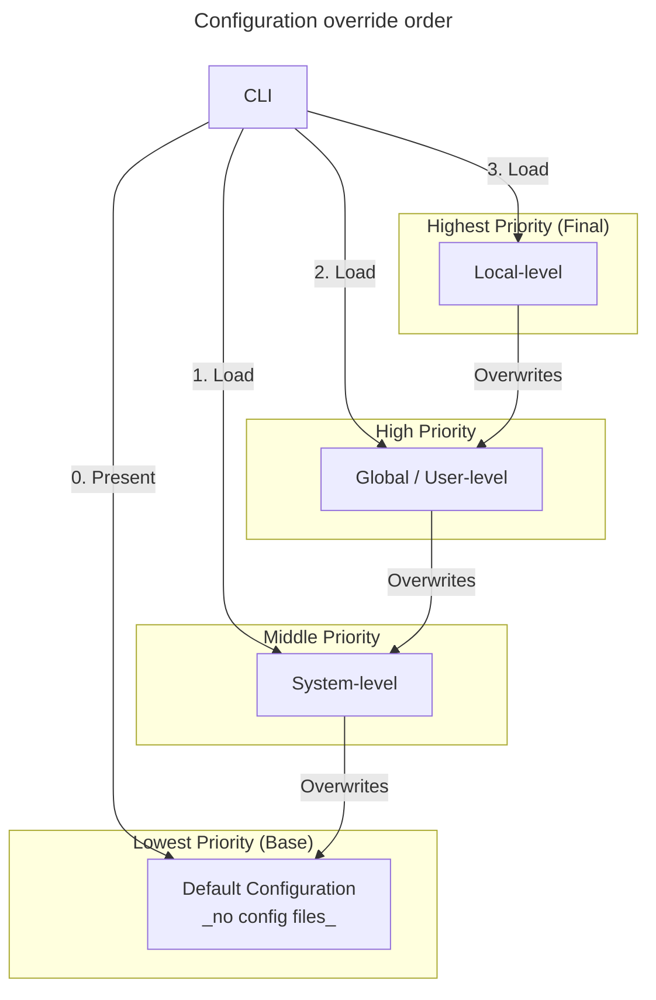

[![Build and analyze][50]][70]
[![Quality Gate Status][51]][71]

# ConnyConsole

ConnyConsole is a console CLI project that uses `System.CommandLine` from Microsoft for argument parsing to collect some
experience with this library.

## Table of content

- [ConnyConsole](#connyconsole)
  - [Table of content](#table-of-content)
  - [Features](#features)
    - [Generic Host \& Dependency Injection](#generic-host--dependency-injection)
    - [Structured Logging with Serilog](#structured-logging-with-serilog)
    - [Cancellation \& Lifecycle Management](#cancellation--lifecycle-management)
    - [Multi-Level Layered Configuration](#multi-level-layered-configuration)
      - [Architecture Goals](#architecture-goals)
      - [Hierarchy \& File Path Mapping](#hierarchy--file-path-mapping)
      - [Configuration load and override flow](#configuration-load-and-override-flow)
    - [Configuration Schema \& Validation](#configuration-schema--validation)
      - [Configuration duration parsing](#configuration-duration-parsing)
    - [Testability](#testability)
  - [Development](#development)
    - [Testing code](#testing-code)
    - [Pipeline](#pipeline)
  - [References/documentation](#referencesdocumentation)

## Features

This chapter provides a rough overview what was implemented as examples.  
Please note, some of the features listed are based on or inspired by the article series [A Beginner's Guide to .NET's HostBuilder: Part 1 and following][5].

### Generic Host & Dependency Injection

- Console startup implemented with **[Host.CreateDefaultBuilder][6]** that enables/contains the following:
  - **Dependency injection** configuration via [`ConfigureServices`][7] and extension method to keep `Program.cs` simple;
    - Own extension method `AddConfiguration` registers all dependencies incl. the following:
      - Logger is configured via configuration injection;
      - Configuration registered for [options pattern][8] usage;
  - **Loads configuration from specific subdirectory** `Config` that contains `appsettings.json` and `appsettings.Development.json`:
    - Current environment resolved from injected [`HostBuilderContext`][9] to use environment specific setting file;
    - Intentionally `appsettings` (here `loggersettings`) files located in subdirectory `Config` to enforce loading them in code explicitly (_as example to bypass appsettings load magic_);
    - Allows CLI to explicitly control the loading order and prioritize the layered configuration approach (System/Global/Local) while maintaining hard-coded default values for core logic;

### Structured Logging with Serilog

- **[Serilog][10]** used for logging:
  - Startup-logger and injectable logger based on configuration files (`loggersettings`);
  - Logging on console and in file with defined format;
  - Serilog can throw strange/not relatable exceptions on app startup when its configured;
    - _when JSON config is wrong, this exceptions will be printed on the console;_
  - Logger configuration is stored in `loggersettings.json` file, because no `appsettings.json` file is used (default configuration is hard-coded);

### Cancellation & Lifecycle Management

- **Graceful and enforceable cancellation** of current async executed _dummy_ logic;
  - First `[Ctrl] + [C]` or `[Ctrl] + [Break]` initiates graceful cancellation;
    - Waits until logic finishes or a configurable timeout reaches and closes the application;
  - Second `[Ctrl] + [C]` or `[Ctrl] + [Break]` initiates immediate enforced cancellation;
    - Application exists immediately;
  - All that magic happens in [`ConsoleCancellationTokenSource`][11] class;
  - Console cancellation event is registered in [`App`][12] class;
- Console application **icon** defined (check `*.csproj` file tag `ApplicationIcon`);

### Multi-Level Layered Configuration

- Supporting a **layered configuration files approach**;
  - Possible to configure on each level the `Cancellation.Timeout` setting (right now no other settings are supported);
  - In regard to the following listed configuration order, the next lower level overrides the one above (more global level):
    1. **System-level**
       - Configuration file is applied to all users of the system;
       - Location: [`SpecialFolder.CommonApplicationData\ConnyConsole\config`][23]
         - Windows: `C:\ProgramData\ConnyConsole\config`
         - Linux: `~/usr/share/ConnyConsole/config`
    2. **Global-level** (aka _User-level_)
    - Configuration file is applied to the user, who created it only;
    - Location: [`SpecialFolder.UserProfile\.connyconfig`][23]
      - Windows: `C:\Users\<username>\.connyconfig`
      - Linux: `~/home/<username>/.connyconfig`
    3. **Local-level**
       - Configuration file is applied to the current working directory only;
       - Location, when current working directory would be `C:\Temp`
         - Windows: `C:\Temp\.connyconsole\config`
         - Linux: `/c/Temp/.connyconsole/config`

#### Architecture Goals

- **Flexibility**
  - Can have a "safe" default (like a 30-second timeout) but easily change it to 5 seconds for just one specific project without editing the global files;
- **Separation of Concerns**
  - It distinguishes between settings that belong to the machine, the developer, and the workspace;
- **Predictable Order**
  - It creates a clear hierarchy (seen diagram _Configuration override order_) where the most "local" or "specific" setting always wins.

#### Hierarchy & File Path Mapping

| **Configuration scope** | **Windows**                          | **Linux**                         | Description                                                                                                         |
| :---------------------- | :----------------------------------- | :-------------------------------- | ------------------------------------------------------------------------------------------------------------------- |
| **System**              | `C:\ProgramData\ConnyConsole\config` | `~/usr/share/ConnyConsole/config` | - Configuration file is applied to all users of the system;                                                         |
| **Global** (_User_)     | `C:\Users\<username>\.connyconfig`   | `~/home/<username>/.connyconfig`  | - Configuration file is applied to the user, who created it only;                                                   |
| **Local**               | `C:\Temp\.connyconsole\config`       | `/c/Temp/.connyconsole/config`    | - Configuration file is applied to the current working directory only;<br/>- Example working directory is `C:\Temp` |

#### Configuration load and override flow



### Configuration Schema & Validation

- **Configuration is stored in JSON format**, according to predefined and cross-checked setting keys;

  - During configuration via CLI a setting key describes its nested level using a dot '.' as a separator;
    - `ConnyConfig config set Cancellation.Timeout 1s`
    - This configures the `Timeout` setting that is nested in the `Cancellation` setting;
  - **Case-Sensitivity**: Note that setting keys for the `config set` command are **case-sensitive** to match the internal schema and JSON property naming;
  - **Validation via Schema**: Supported setting keys are hard-coded in a `Dictionary<string, object>` within the [AppSettings model][25];
    - Dictionary uses boolean values (`true`) to mark leaf nodes (actual settings) and nested dictionaries to represent the hierarchy;
    - Before value is written, editor verifies that provided key path exists within schema;
  - **Configuration Editor**: The [`JsonConfigurationEditor`][24] manages the physical file I/O;
    - Parses existing JSON (if any), traverses the tree according to the dot-notation key, and either updates existing value or creates necessary objects to reach the new setting;

```csharp
// Example: How supported configuration keys are defined in the schema
private static readonly Dictionary<string, object> SupportedSettingKeys = new()
{
    ["LoopOutputInterval"] = true, // Top-level setting
    ["Cancellation"] = new Dictionary<string, object>
    {
        ["Timeout"] = true,        // Nested setting: Cancellation.Timeout
        ["RetryPolicy"] = new Dictionary<string, object>
        {
            ["Enabled"] = true     // Deeply nested: Cancellation.RetryPolicy.Enabled
        }
    }
};
```

```json
/* Example: Resulting configuration file structure */
{
  "LoopOutputInterval": "00:00:01",
  "Cancellation": {
    "Timeout": "00:00:30",
    "RetryPolicy": {
      "Enabled": false
    }
  }
}
```

#### Configuration duration parsing
- Duration configuration more user-friendly, custom [`DurationTimeParser`][28] implemented for time-based settings (like `Cancellation.Timeout`);
- Allows users provide intuitive values instead of raw TimeSpan strings;
  - Supports various input formats such as:
    - `500ms` (milliseconds)
    - `10s` (seconds)
    - `5m` (minutes)
    - `1h` (hours)

### Testability

- For the sake of testability environment and file system abstracted;
  - File system and environment paths abstracted with [System.IO.Abstraction][26], unit tests can simulate System, Global, and Local directory structures without touching the actual developer's disk;
  - The project uses the [`EnvironmentAbstractions`][27] package to ensure the configuration-level providers are testable;

## Development

### Testing code

As an application is only as good as it was tested, this chapter gives some insights into how the console application
tests were implemented.

- Unit tests are implemented with the following libraries/frameworks:
  - [AutoFixture.AutoNSubstitute][15]
  - [AwesomeAssertions][16] (fully community-driven fork of _FluentAssertions_)
  - [NSubstitute][17]
  - [xUnit][14]
- Graceful + enforced cancellation are tested with simulated `[Ctrl] + [C]` keys pressed ([
  `ConsoleCancellationTokenSourceTests.cs`][13]);
- Dependency injection extension method incl. lifetime checks;
  - Lifetime check helps to notice fast if a lifetime was changed by accident or just to highlight that it was changed
    in general;
- Async dummy logic execution;

### Pipeline

This chapter provides an overview of what the current build pipeline provides.

- [GitVersion][18] integrated for auto [SemVer (Semantic Versioning)][19] based on Git history;
- [SonarQube][20] (cloud, free plan) integrated;
- Build console application with `Release` configuration;
- Run tests;
  - Collect test run results as `*.trx` file;
  - Collect code coverage in `OpenCover` format, later on used to publish on SonarQube;
    - Done by using [coverlet.msbuild + coverlet.collector][21] (_in test project only_);
  - Both files, the coverage file and test result file, are published as build artifacts;
  - Passed, failed and skipped tests listed as part of run summary, realized with [`GitHubActionsTestLogger`][22]
    package;

## References/documentation

The following are some used articles listed.

- [Parse the Command Line with System.CommandLine][1]
- [System.CommandLine overview][2]
- [System.CommandLine on GitHub][3]
- [Tutorial: Get started with System.CommandLine][4]
- [A Beginner's Guide to .NET's HostBuilder: Part 1 and following][5]

<!--# Not Markdown compliant, but the only proper working solution to center content on GitHub -->
<div align="center">
  <a href="https://sonarcloud.io/summary/overall?id=HaGGi13_ConnyConsole" target="_blank" title="Overall code analysis overview">
    
  </a>
</div>

<!--# references -->

[1]: https://learn.microsoft.com/en-us/archive/msdn-magazine/2019/march/net-parse-the-command-line-with-system-commandline "Parse the Command Line with System.CommandLine"
[2]: https://learn.microsoft.com/en-us/dotnet/standard/commandline/ "System.CommandLine overview"
[3]: https://github.com/dotnet/command-line-api "GitHub: dotnet > command-line-api"
[4]: https://learn.microsoft.com/en-us/dotnet/standard/commandline/get-started-tutorial "Tutorial: Get started with System.CommandLine"
[5]: https://medium.com/@sawyer.watts/a-beginners-guide-to-net-s-hostbuilder-part-0-78882aab60f8 "Medion: HostBuilder article series"
[6]: https://learn.microsoft.com/en-us/dotnet/api/microsoft.extensions.hosting.host.createdefaultbuilder?view=net-9.0-pp#microsoft-extensions-hosting-host-createdefaultbuilder "MS Docs: Host.CreateDefaultBuilder Method"
[7]: https://learn.microsoft.com/en-us/dotnet/api/microsoft.extensions.hosting.ihostbuilder.configureservices?view=net-9.0-pp&viewFallbackFrom=net-9.0 "MS Docs: IHostBuilder.ConfigureServices Method"
[8]: https://learn.microsoft.com/en-us/dotnet/core/extensions/options "MS Docs: Options pattern in .NET"
[9]: https://learn.microsoft.com/en-us/dotnet/api/microsoft.extensions.hosting.hostbuildercontext?view=net-9.0-pp "MS Docs: HostBuilderContext Class"
[10]: https://serilog.net/ "Serilog web site"
[11]: src/ConnyConsole/Infrastructure/ConsoleCancellationTokenSource.cs "Graceful + enforced cancellation logic"
[12]: src/ConnyConsole/App.cs#L41 "Console cancellation event registration"
[13]: tests/ConnyConsole.Tests/ConsoleCancellationTokenSourceTests.cs "Cancellation unit tests"
[14]: https://xunit.net/ "xUnit web site"
[15]: https://github.com/AutoFixture/AutoFixture?tab=readme-ov-file#mocking-libraries "GitHub: AutoFixture > Mocking libraries"
[16]: https://github.com/AwesomeAssertions/AwesomeAssertions "GitHub: AwesomeAssertions"
[17]: https://nsubstitute.github.io/ "NSubstitute web site"
[18]: https://gitversion.net/docs/ "GitVersion documentation"
[19]: https://semver.org/ "Semantic Versioning 2.0.0 documentation"
[20]: https://www.sonarsource.com/products/sonarcloud/ "SonarQube Cloud product web site"
[21]: https://github.com/coverlet-coverage/coverlet "GitHub: Coverlet repository"
[22]: https://github.com/Tyrrrz/GitHubActionsTestLogger "GitHub: GitHubActionsTestLogger repository"
[23]: https://learn.microsoft.com/en-us/dotnet/api/system.environment.specialfolder?view=net-9.0 "MS Docs: Environment.SpecialFolder enum"
[24]: src/ConnyConsole/Services/JsonConfigurationEditor.cs "JSON configuration editor"
[25]: src/ConnyConsole/Settings/AppSettings.cs "AppSettings model incl. setting key exist check"
[26]: https://github.com/TestableIO/System.IO.Abstractions "GitHub: System.IO.Abstractions"
[27]: https://github.com/jeffkl/EnvironmentAbstractions "GitHub: EnvironmentAbstractions"
[28]: src/ConnyConsole/Settings/DurationTimeParser.cs "Duration parser implementation"

<!--# badge image references -->

[50]: https://github.com/HaGGi13/ConnyConsole/actions/workflows/build-connyconsole.yaml/badge.svg
[51]: https://sonarcloud.io/api/project_badges/measure?project=HaGGi13_ConnyConsole&metric=alert_status

<!--# badge link references -->

[70]: https://github.com/HaGGi13/ConnyConsole/actions/workflows/build-connyconsole.yaml "Build pipeline"
[71]: https://sonarcloud.io/summary/new_code?id=HaGGi13_ConnyConsole "Latest new code analysis"
